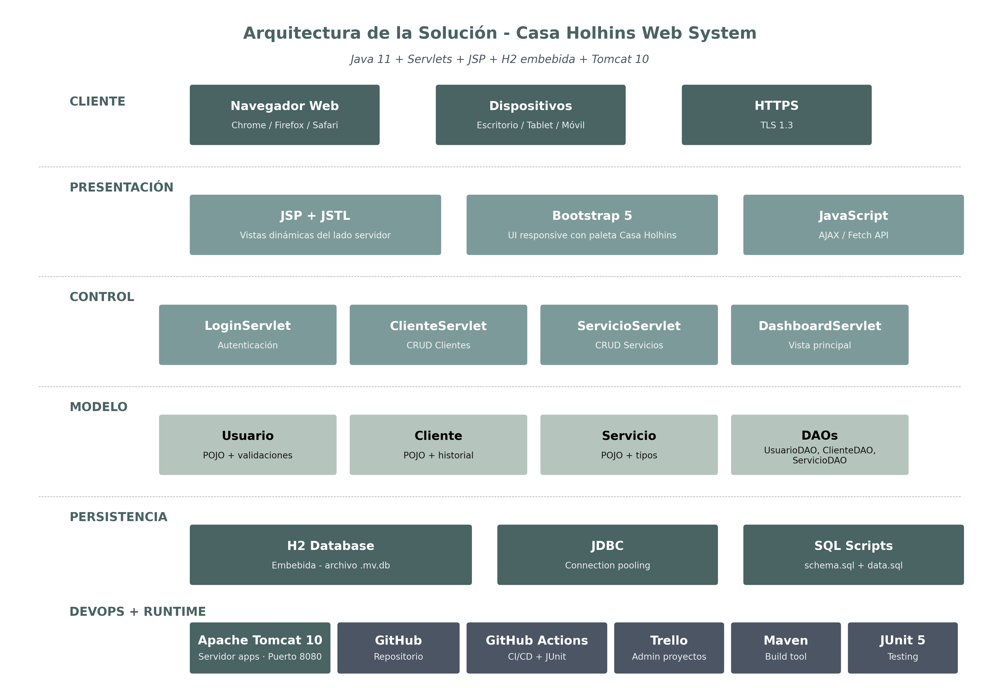

# Casa Holhins Web System


Sistema web CRM integral desarrollado para Casa Holhins, empresa de bienestar holístico en Tizayuca, Hidalgo. 
Este MVP permite administrar clientes y un catálogo de servicios (terapias, cursos, diplomados) de manera centralizada.

## 🏢 Sobre Casa Holhins

Casa Holhins es una empresa de bienestar holístico ubicada en Tizayuca, Hidalgo, dirigida por Ana María Trejo Holhins. Ofrece servicios de terapia energética, masaje, sonoterapia y formación certificada en técnicas holísticas.

Este sistema fue desarrollado como Evidencia Integradora del Certificado en Java de la Universidad Tecmilenio, con **autorización formal de la Dirección General** para publicar el código bajo licencia MIT en la comunidad de código libre. El sistema será desplegado en producción para uso operativo real de la empresa una vez completadas las iteraciones futuras del roadmap.

**Rol del desarrollador:** Angel Gabriel Carrizales Trejo funge como CFO/Consultor de Casa Holhins, lo cual permitió un levantamiento de requerimientos directo y continuo con la usuaria final.

## Arquitectura del Proyecto



El sistema sigue un patrón Modelo-Vista-Controlador (MVC) apoyado por Servlets y JSP bajo Jakarta EE 10. La capa de datos utiliza JDBC contra una base de datos embebida H2.

## Screenshots

### Login
[ Espacio para Screenshot Login ]

### Dashboard Principal
[ Espacio para Screenshot Dashboard ]

### Catálogo de Servicios
[ Espacio para Screenshot Servicios ]

## Requerimientos Técnicos

- **Java JDK 11**
- **Apache Tomcat 10.1+**
- **Maven 3.9+**

## Instalación y Configuración

1. Clonar este repositorio:
   ```bash
   git clone https://github.com/matsukiender-star/casa-holhins-web.git
   cd casa-holhins-web
   ```

2. Empaquetar el proyecto con Maven:
   ```bash
   mvn clean package
   ```

3. El archivo WAR se generará en `target/casa-holhins-web.war`.

## Ejecución (Deploy)

1. Copiar el archivo WAR al directorio `webapps` de Tomcat:
   ```bash
   cp target/casa-holhins-web.war ~/dev-tools/apache-tomcat-10.1.55/webapps/
   ```

2. Arrancar Tomcat:
   ```bash
   ~/dev-tools/apache-tomcat-10.1.55/bin/startup.sh
   ```

3. Abrir el navegador en:
   `http://localhost:8080/casa-holhins-web/`

## Manual de Uso

### Manual para Administrador
El administrador (usuario `admin`, password `admin123`) tiene acceso completo a:
- **Gestión de Clientes:** Alta, edición, baja lógica (Inactivar).
- **Catálogo de Servicios:** Crear nuevas terapias, talleres, diplomados o cursos y establecer sus precios.
- **Dashboard:** Visualizar de un vistazo los últimos clientes registrados y los contadores totales de activos.

### Manual para Usuario Final (Staff)
El usuario staff (usuario `staff`, password `staff123`) puede acceder para revisar información operativa, aunque en versiones futuras los roles restringirán capacidades sensibles.

## 🗺️ Roadmap

Este MVP cubre las funcionalidades técnicas base (autenticación, CRM básico y catálogo de servicios). Sin embargo, durante el desarrollo del proyecto se realizó una **entrevista con la Directora General y la secretaria** de Casa Holhins que reveló las necesidades operativas reales de la empresa. Las siguientes iteraciones del sistema atenderán esas necesidades específicas:

### 📅 Iteración 2: Módulo de Agenda de Citas (Prioridad: Alta)

**Problema real identificado:** actualmente la gestión de citas ocurre en Google Calendar con etiquetas de colores por tipo de servicio, y la secretaria recibe capturas de pantalla del calendario vía WhatsApp para coordinar. Esto genera duplicidad de trabajo y riesgo de citas perdidas.

**Solución propuesta:**
- Calendario web integrado con vista mensual, semanal y diaria
- Etiquetas por servicio con colores (Access Bars, Masaje Tao, Maratón, Diplomado, Consulta, etc.)
- Diferenciación clara entre citas online (mañanas) y presenciales (tardes)
- Vista compartida entre Directora y secretaria en tiempo real
- Notificación automática a la secretaria por WhatsApp cuando se agenda una cita nueva

### 💰 Iteración 3: Módulo de Flujo de Caja (Prioridad: Alta)

**Problema real identificado:** los pagos se registran manualmente en apps de notas: quién pagó, qué servicio recibió, forma de pago (efectivo/tarjeta), y quién colaboró. No existe caja chica formal ni respaldo de dinero para emergencias.

**Solución propuesta:**
- Registro de ingresos con: fecha, servicio, monto, forma de pago, colaborador asociado
- Registro de egresos: pagos a colaboradores, gastos operativos, retiros
- Reporte de flujo de caja diario, semanal y mensual
- Alerta de saldo bajo en caja chica
- Reporte de comisiones por colaborador

### 👥 Iteración 4: Directorio de Colaboradores (Prioridad: Media)

**Problema real identificado:** los talleristas y terapeutas externos que colaboran con Casa Holhins se registran mezclados con los clientes en las notas de pagos, dificultando el seguimiento de comisiones y sesiones asignadas.

**Solución propuesta:**
- Ficha de colaborador separada de la de cliente
- Registro de sesiones realizadas por colaborador
- Comisión configurable por servicio o por sesión
- Reporte de pagos pendientes a cada colaborador
- Historial de colaboraciones para acuerdos futuros

### 📱 Iteración 5: Integración con WhatsApp Business (Prioridad: Media)

**Problema real identificado:** toda la comunicación con clientes y coordinación interna ocurre por WhatsApp, pero de forma manual.

**Solución propuesta:**
- Envío automático de confirmación de cita al cliente
- Recordatorio 24 hrs antes de la sesión
- Notificación a la secretaria cuando se agenda una nueva cita
- Encuesta post-servicio automatizada
- Registro histórico de conversaciones vinculadas al cliente

### 📊 Iteración 6: Reportes Ejecutivos (Prioridad: Baja)

**Problema real identificado:** no hay dashboard que muestre KPIs de la operación en tiempo real, la Directora estima el desempeño del negocio empíricamente.

**Solución propuesta:**
- Dashboard con ventas del mes, servicios más solicitados, tasa de retención
- Reporte de horarios de mayor demanda (online vs presencial)
- ROI de campañas de marketing (Access Bars, Diplomados)
- Exportación a PDF y Excel para uso contable

### 🚫 Fuera del alcance de este certificado

Los siguientes módulos se mencionan en el planteamiento inicial (Fase II) pero se dejan para un proyecto futuro más ambicioso, ya que requieren infraestructura adicional:

- **Módulo de Pagos con pasarela**: procesamiento con tarjeta requiere convenio con Stripe/MercadoPago
- **Programa de Referidos**: requiere módulo de agenda y flujo de caja consolidados primero
- **Encuestas y Testimonios públicos**: requiere módulo de WhatsApp implementado

---

**Nota metodológica:** este roadmap fue construido después de un levantamiento de requerimientos REAL con la usuaria final (Directora General), no como especulación inicial. Este ajuste refleja el principio ágil de que los requerimientos evolucionan al conocer mejor al cliente, y demuestra el valor de la investigación de usuario continua sobre el diseño inicial cerrado.

## Enlaces Útiles
- [Wiki del Proyecto](https://github.com/matsukiender-star/casa-holhins-web/wiki)

## Guía de Contribución

1. Crea una rama para tu feature: `git checkout -b feature/mi-nueva-funcionalidad`
2. Realiza commits pequeños y descriptivos: `git commit -m "feat: agrega formulario de clientes"`
3. Empuja tu rama al repositorio: `git push origin feature/mi-nueva-funcionalidad`
4. Crea un Pull Request contra la rama `develop`.

## Licencia

Este proyecto está bajo la Licencia MIT.
